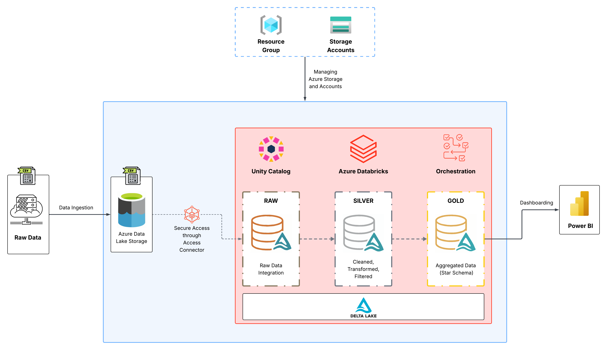
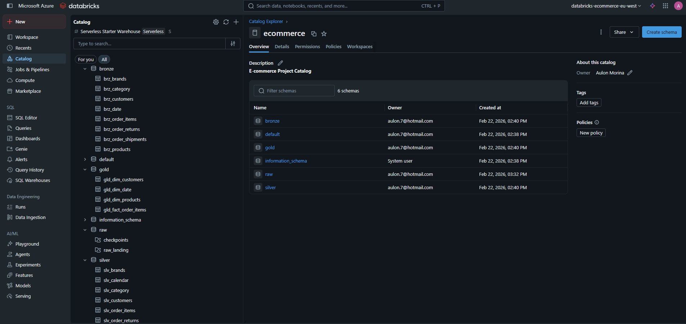
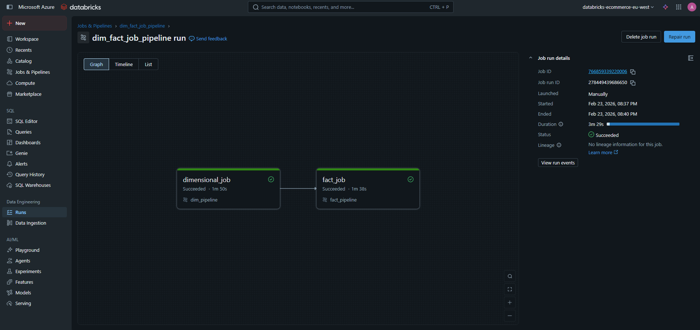
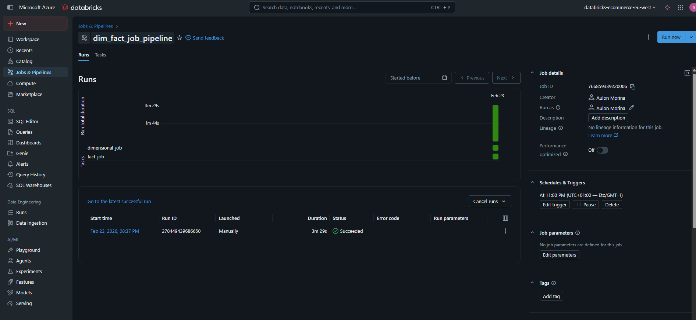

# E-Commerce Analytics Pipeline (Azure Databricks)

A modern data pipeline for e-commerce analytics using Azure Databricks, Delta Lake, and Power BI.

## Architecture Diagram

## Architecture Summary

- **Bronze Layer**: Raw ingestion (streaming) from ADLS Gen2 using Auto Loader.
- **Silver Layer**: Cleaned, filtered, deduplicated, and standardized data (batch SQL MERGE).
- **Gold Layer**: Business-ready star schema for BI (batch SQL CREATE).

## Data Model

- **Dimensions**: Products, Customers, Date (with region, category, brand enrichment)
- **Facts**: Order Items (with calculated revenue, discount, net amount)

## Pipeline Flow

1. **Ingest**: Stream raw CSVs to bronze tables with metadata.
2. **Transform**: Clean, deduplicate, and standardize in silver tables.
3. **Model**: Build star schema in gold tables for analytics.
4. **Analyze**: Connect Power BI to gold tables for dashboards.

## Key Features

- Medallion architecture (Bronze → Silver → Gold)
- Explicit schema enforcement and data quality checks
- Incremental and batch processing
- Star schema for fast BI queries
- Power BI-ready tables

## Data Governance & Jobs Orchestrating

### Catalog Explorer showing **ecommerce** catalog and schemas, logically partitioned into **Bronze**, **Silver** and **Gold**.

- _Catalog Explorer showing ecommerce catalog and schemas._

### Pipeline orchestration using DAG in Databricks Workflow and automation of scheduled jobs for processing.

- _The visual DAG showing dimensional_job connected to fact_job._

    

- _The run history showing duration, status, and manual/scheduled triggers._

    
